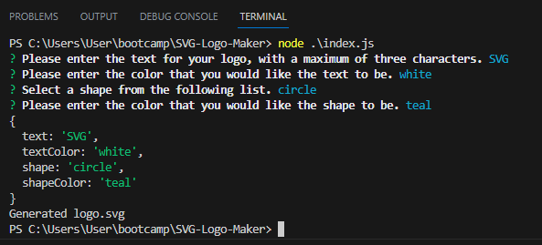
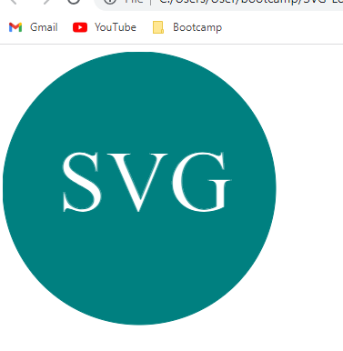

# SVG Logo Maker
 
  
 
  ## Table of Contents
  
  [Description](#description)

  [Installation](#installation)
  
  [Usage](#usage)

  [Contribute](#contribute)

  [Test](#test)
  
  [Credits](#credits)
  
  [License](#license)

  [Questions](#questions)
  
  ## Description
  This is a command line application that takes user input and builds a simple SVG logo that contains text up to 3 characters, color for that text, a background shape that is either a square, a triangle, or a circle, and color for that shape.

  ## Installation
  This application requires nodejs and the npm package Inquirer, version 8.2.4.

  ## Usage
  After performaing an npm install, users can begin the application by typing node ./index.js in the command termainal. Once the application is running, users will answer 4 prompts. The first prompt requires that a user inputs 1-3 characters for the Logo. The user will then type in the color that they want that text to be (RGB values are also acceptable).  The user will then choose if they want the background shape to be a circle, a triangle, or a square. Lastly, they will type in the color (or RGB values) for the shape. The application will then update the file logo.svg with the code for the item. In order to view the shape, the user can then copy and paste the svg element code into svgViewer.html to view it in the browswer.
  
  
  
  
  
  [Screen recording: (https://drive.google.com/file/d/1IjZ73oSJiADj81c45HJcHExwX5G0K7fO/view)]
  
  ## Contribute
  [GitHub Repo: (https://github.com/AdamJohnson92/SVG-Logo-Maker)]
  
  ## Credits
  Assistance with bringing data from the ShapeCode constructor to the generateLogo file courtesy of BCS TA Toacin Patwary. SVG formatting gained from MDN web docs on svg.

  ## License
  
  This project does not have a license.

  ## Questions?

  Contact me at:

  GitHub: https://github.com/AdamJohnson92
  
  email: adamgjohnson92@gmail.com